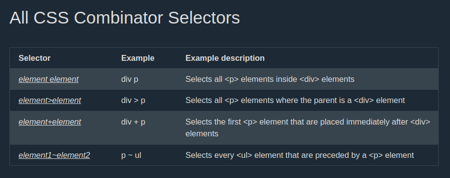
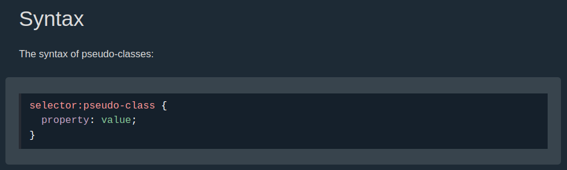
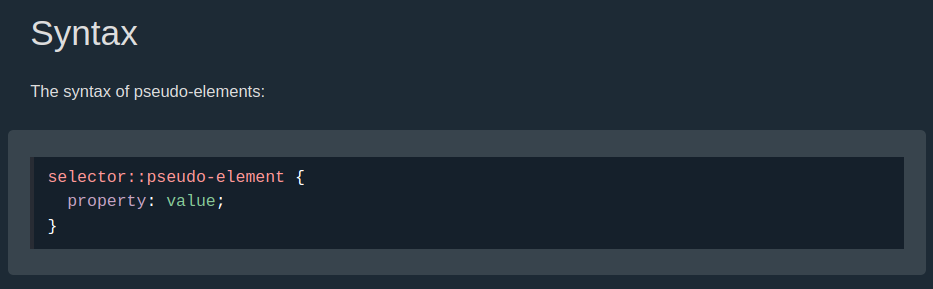
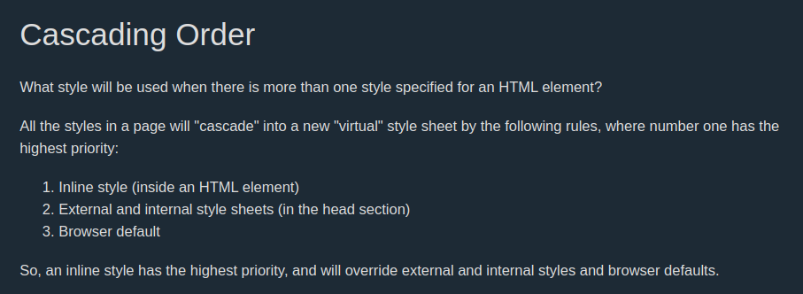

# CSS TUTORIALS ft phuquocchamp

#### 1. Css introduction

#### 2. Css Syntax

#### 3. Css Selector 

- Simple selectors

  - tag name
  - id
  - class
- Combinator selectors : diễn tả mối quan hệ giữa các selectors.

  - descendant selector (space): div a {...} --> chọn tất cả thẻ con a là hậu dệu của thẻ div.
  - child selector (>) : div > a {...} --> chọn tất cả thẻ a là con trực tiếp của thẻ div
  - adjacent sibling selector (+) : div + p --> chọn  thẻ p nằm ngay sau thẻ div. (cùng cấp với thẻ div).
  - general sibling selector (~) : div  ~ p --> chọn tất cả thẻ p nằm sau thẻ div (cùng cấp với thẻ div).

  
- Pseudo-classes : Lớp giả là lớp được sử dụng để định nghĩa một trạng thái đặc biệt của một thẻ.

  
- Psuedo-elements selectors : phần tử giả CSS được sử dụng để tạo kiểu cho một phần của thẻ. Như Css cho chữ cái đầu, dòng đầu, chèn nội dung vào trước, sau nội dung của thẻ.

  

#### 4. How to add Css

3 Ways to add Css in HTML Document

- inline CSS.
- Internal CSS.
- External CSS.

>  Thứ tự ưu tiên CSS : 
>
> - Inline CSS
> - Internal or External CSS | tùy vào vị trí của được đặt trong thẻ head.
> - browser default.

1. 

#### 5. CSS Backgrounds

- **background-color :** dùng để chỉ định thuộc tính màu nền cho một thẻ.
- **opacity :** dùng để chỉ định thuộc tính trong suốt của một thẻ (0.0 --> 1.0) chỉ số càng nhỏ thì càng trong suốt.

  > Khi sử dụng thuộc tính opacity để thêm trong suốt cho màu nền của thẻ, điều này cũng làm cho tất cả các thẻ con cũng thừa hưởng thuộc tính này --> làm cho màu của text trong thẻ bị mờ đi.
  >
- Nếu ta chỉ muốn làm trong suốt chỉ màu nền của thẻ mà không làm ảnh hướng đến chữ viết, .. thì ta có thể sử dụng màu RGBA.
- **background-image** : thuộc tính dùng để chỉ định hình ảnh là hình nền của thẻ. Mặc định thuộc tính background-image sẽ lặp lại các ảnh để khớp với kích thuớc của thẻ.
- **background-repeat:** ta có thể thay đổi hướng lặp của hình (theo trục x hoặc y) hoặc **no-repeat**.
- **background-position**: dùng để chỉ định vị trí bắt đầu của ảnh nền.
- background-attachment : dùng để chỉ định khi nào thì hình nền nên được cuộn hoặc được cố định.
- **background** : ta có thể ghi ngắn gọn lại các thuộc tính ở trên trong một thuộc tính background. Khi sử dụng shorthand thì thứ tự các thuộc tính phải tuân thủ như sau:

  * `background-color`
  * `background-image`
  * `background-repeat`
  * `background-attachment`
  * `background-position`
